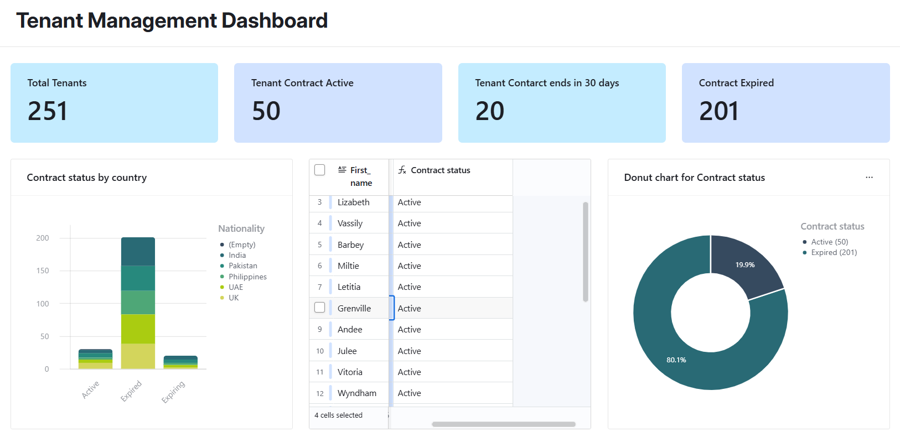
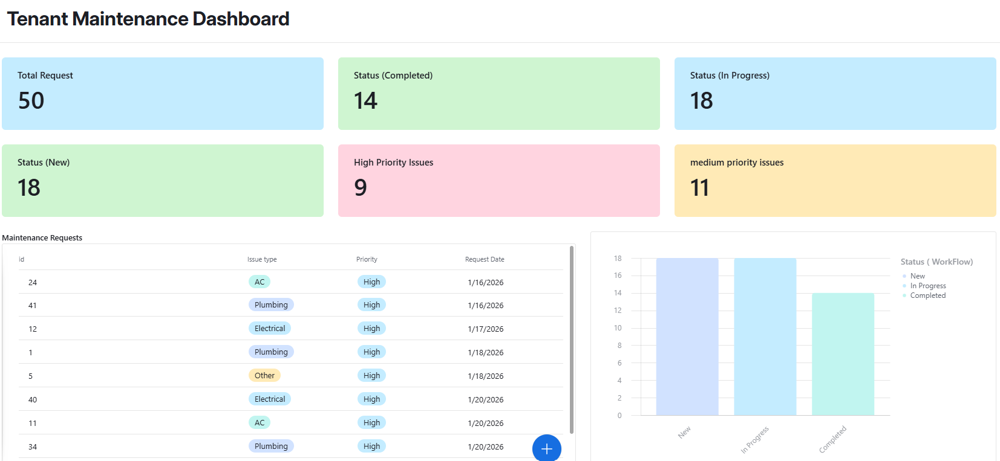

# Tenant-Operational-Dashboard
Tenant management and maintenance analytics dashboard built using Airtable
# 🏠 Tenant & Property Operations Analytics System

## 📌 Overview

A data-driven Tenant & Property Operations Analytics System built using Airtable. The solution combines tenant lifecycle management and maintenance request tracking into a centralized platform, enabling property managers to monitor contracts, rental revenue, operational performance, and maintenance workflows through interactive dashboards and KPI-driven insights.

> **Note:** The dataset used in this project is synthetically generated to simulate real-world property management operations for demonstration and portfolio purposes.

---

## 🎯 Problem Statement

Property management teams often face challenges such as:

* Managing tenant information across multiple spreadsheets
* Limited visibility into contract expiry risks
* Difficulty tracking rental revenue performance
* Inefficient maintenance request handling
* Lack of centralized reporting and analytics

---

## 💡 Solution

To address these challenges, I designed a dual-dashboard system using Airtable:

### 1️⃣ Tenant Management Dashboard

Tracks tenant information, contract status, payment status, and rental revenue metrics.

### 2️⃣ Maintenance Management Dashboard

Tracks maintenance requests, issue priorities, workflow status, and operational efficiency metrics.

---

# 📊 Tenant Management Dashboard

## Key Metrics

| Metric                        | Value |
| ----------------------------- | ----- |
| Total Tenants                 | 251   |
| Active Contracts              | 50    |
| Contracts Expiring in 30 Days | 20    |
| Expired Contracts             | 201   |

## Revenue Analytics

| Revenue Category   | Amount (AED) |
| ------------------ | ------------ |
| Active Contracts   | 4,340,000    |
| Expiring Contracts | 19,860,000   |
| Expired Contracts  | 18,000,000   |

## Visualizations

* 📊 Contract Status by Country (Bar Chart)
* 🍩 Contract Status Distribution (Donut Chart)
* 🥧 Family Member Distribution (Pie Chart)
* 📉 Contract End Days vs Payment Status Analysis

### Business Value

The dashboard provides visibility into tenant lifecycle trends, contract renewal opportunities, revenue exposure, and payment performance.

---

# 🛠 Maintenance Management Dashboard

## Key Metrics

| Metric                 | Value |
| ---------------------- | ----- |
| Total Requests         | 50    |
| New Requests           | 18    |
| Completed Requests     | 14    |
| In Progress Requests   | 18    |
| High Priority Issues   | 9     |
| Medium Priority Issues | 11    |

## Issue Categories

* Air Conditioning (AC)
* Plumbing
* Electrical

## Operational Tracking

* Priority-based request classification
* Status-based workflow management
* Request date tracking
* Maintenance history monitoring

## Visualizations

* 📊 Request Status Distribution (Bar Chart)
* 🍩 Workflow Status Breakdown (Donut Chart)
* 🥧 New Request Ratio (Pie Chart)

### Sample Maintenance Data

| Request ID | Issue Type | Priority | Request Date |
| ---------- | ---------- | -------- | ------------ |
| 24         | AC         | High     | 16-Jan-2026  |
| 41         | Plumbing   | High     | 16-Jan-2026  |
| 12         | Electrical | High     | 17-Jan-2026  |

---

# 🏗 System Architecture

## Data Layer

* Airtable Base
* Tenant Table
* Contract Table
* Maintenance Request Table

## Business Modules

### Tenant Management Module

* Tenant records
* Contract lifecycle tracking
* Rent analytics
* Payment monitoring

### Maintenance Operations Module

* Request management
* Priority handling
* Status tracking
* Service monitoring

## Analytics Layer

* KPI dashboards
* Revenue reporting
* Contract status analysis
* Maintenance performance analytics

---

# 🔥 Key Insights

### Tenant Operations

* More than 80% of contracts are expired, highlighting potential renewal and revenue recovery opportunities.
* Revenue segmentation provides visibility into active, expiring, and expired contract value.
* Contract monitoring helps identify upcoming renewal risks.

### Maintenance Operations

* Maintenance requests are distributed across multiple workflow stages.
* Priority-based categorization helps identify critical operational issues.
* Centralized tracking improves maintenance response visibility.

---

# 🧰 Tech Stack

* **Airtable** – Database & Dashboard Platform
* **Airtable Interfaces** – Dashboard Development
* **Airtable Charts** – Data Visualization
* **Data Modeling** – Relational Database Design
* **Business Intelligence (BI)** – KPI Reporting & Analytics

---

# 📈 Features

✅ Tenant Lifecycle Management
✅ Contract Status Monitoring
✅ Rental Revenue Analytics
✅ Maintenance Request Tracking
✅ Priority-Based Issue Management
✅ Interactive KPI Dashboards
✅ Operational Performance Monitoring
✅ Data-Driven Decision Support

---

# 📌 Impact

* Centralized tenant and maintenance management data
* Improved visibility into contract and revenue performance
* Structured maintenance workflow tracking
* Enhanced operational monitoring through KPI dashboards
* Demonstrated business intelligence and dashboard design capabilities using Airtable

---

## 📸 Screenshots

## 📸 Tenant Management Dashboard

## 📸 Maintenance Management Dashboard

---

## 👨‍💻 Author

**Kamal Batcha**

AI/ML Engineer | Data Analytics | Business Intelligence | Dashboard Design
